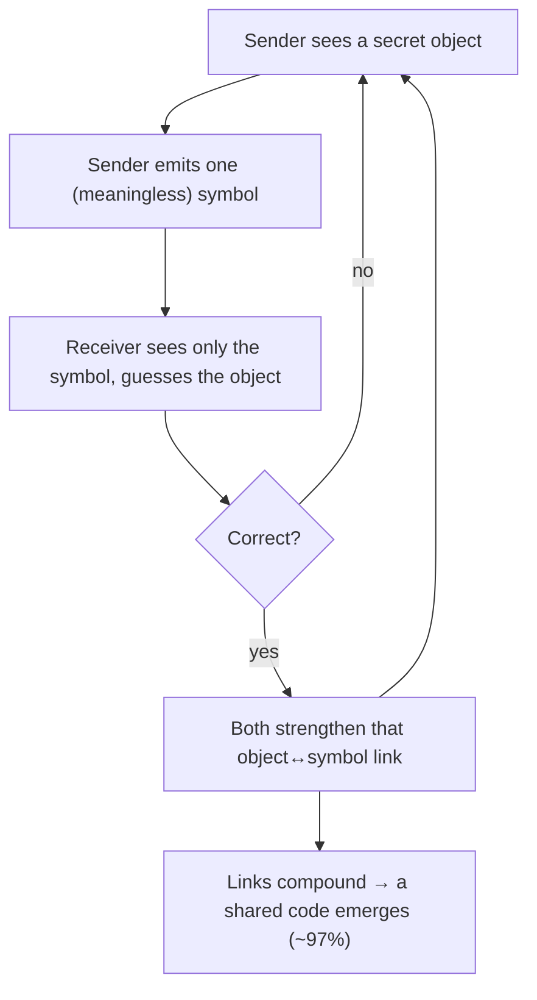

# 🗣️ Agents Invent Their Own Language

Two agents start with **no shared words** and play a signaling game. From "did the guess
land?" alone they converge on a private code (~**97%**). Reseed and they invent a *different*
one — arbitrary, but agreed. Remove their memory and it never sets (~56%, chance).

Pure standard library. No GPU, no API key.

```bash
python demo.py
```



📖 Full write-up: [BLOG.md](./BLOG.md)
