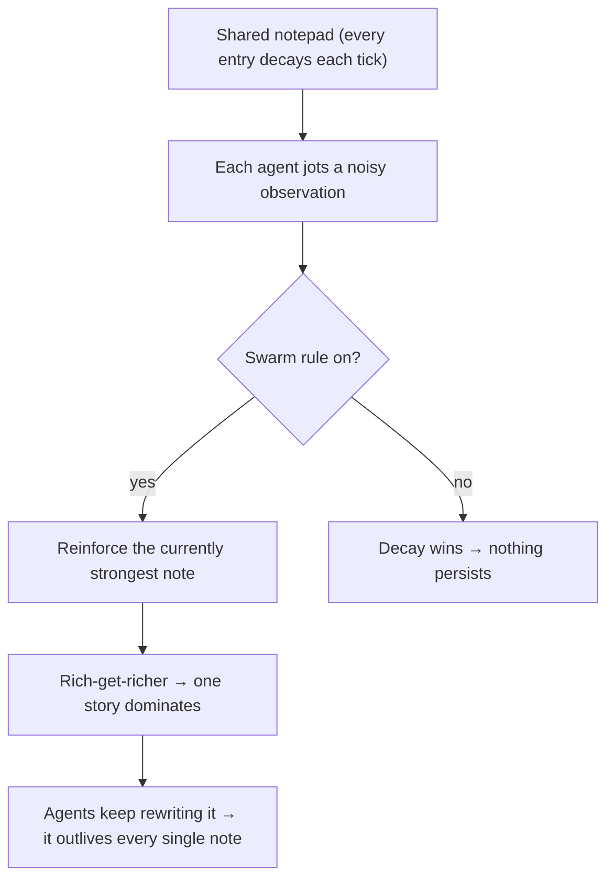

# 🏛️ Agents Build a Culture

Three minimal agents share **one notepad that constantly decays** (a note left alone dies in
~4 ticks). From one rule — *"reinforce whatever the group already backs"* — a shared story
emerges and lasts the whole 100-tick run (present **100%**, stable **99%**), long after the
original note is gone. Turn the rule off and it's just decaying noise (~**11%**).

This is **stigmergy**: termites building a cathedral by reacting to each other's traces. Pure
standard library, no GPU or API key.

```bash
python demo.py
```



📖 Full write-up: [BLOG.md](./BLOG.md)
