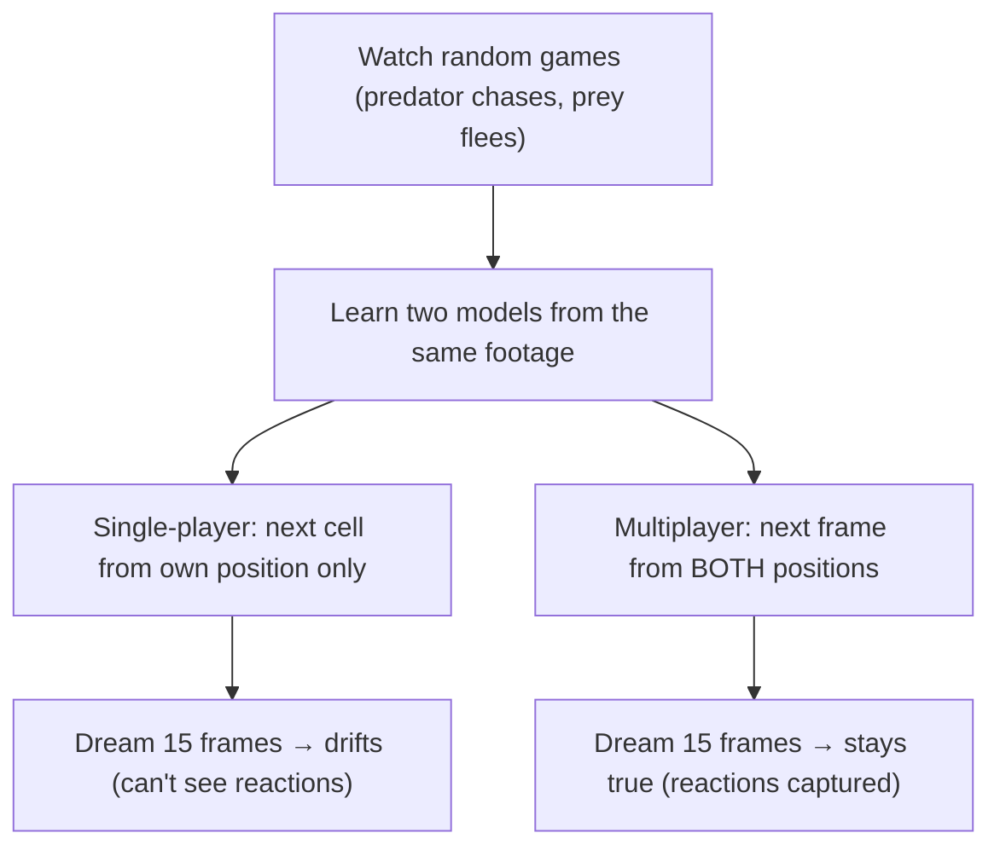

# 🌀 Agents in a Dreamed-Up World

An agent learns a **world model** just by watching, then *dreams* the future by feeding its
own predictions back in, frame after frame ([Ha & Schmidhuber, 2018](https://arxiv.org/abs/1803.10122)).
The open frontier is making that dream **multiplayer**.
A predator chases a prey in a corridor; both react. Same footage, two learned models:

- **Single-player dream** (each player from its own cell): drifts and collapses in a frame or two.
- **Multiplayer dream** (next frame from *both* players): stays true across all **15** frames.

Pure standard library, no GPU or API key.

```bash
python demo.py
```



📖 Full write-up: [BLOG.md](./BLOG.md)
